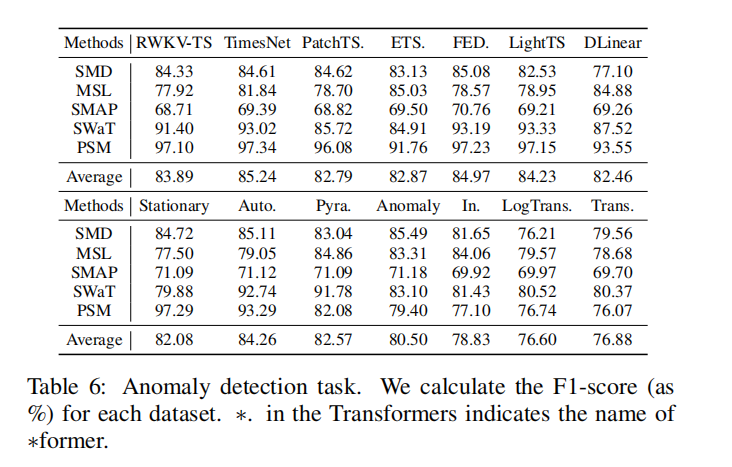

# RWKV-TS: A Linear Recurrent Neural Network for Time Series Tasks

## Anomaly Detection
The experimental results of Anomaly Detection presented in Table blow.


## Get Start

- Install Python>=3.8, PyTorch 1.8.1.
- Download data. You can obtain all the benchmarks from [[TimesNet](https://github.com/thuml/Time-Series-Library)].
- Train the model. We provide the experiment scripts of all benchmarks under the folder `./scripts`. You can reproduce the experiment results by:

```bash
bash ./scripts/MSL.sh
bash ./scripts/PSM.sh
```