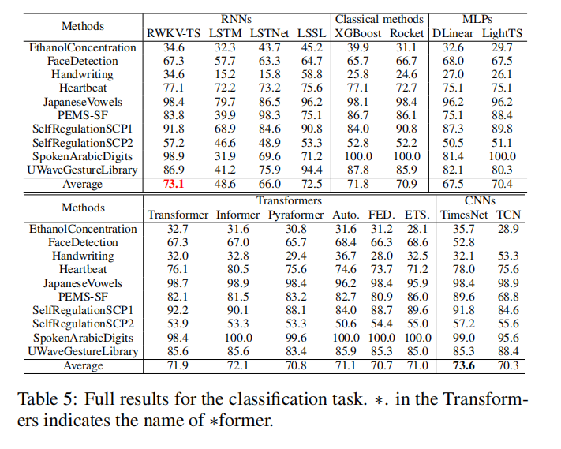

# RWKV-TS: Beyond Traditional Recurrent Neural Network for Time Series Tasks

## Time series Classification
The experimental results of time series classification presented in Table blow.


## Get Start

- Install Python>=3.8, PyTorch 1.8.1.
- Download data. You can obtain all the benchmarks from [[mvts](https://github.com/gzerveas/mvts_transformer)].
- Train the model. We provide the experiment scripts of all benchmarks under the folder `./scripts`. You can reproduce the experiment results by:

```bash
bash ./scripts/EthanolConcentration.sh
```