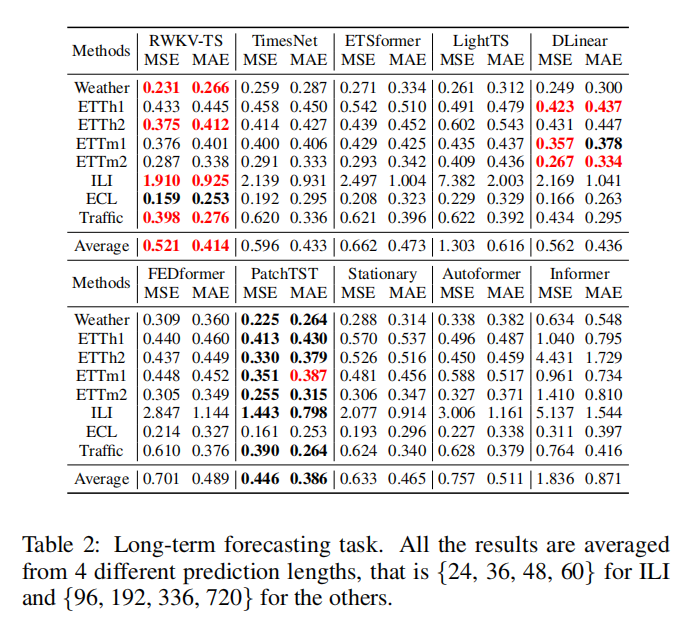

# RWKV-TS: RWKV for Time Series

placeholder for paper in future

## Long-term Learning



## Get Start

- The code is the same as few-shot leanring with 100 percent.
- Install Python>=3.8, PyTorch 1.8.1.
- Download data. You can obtain all the benchmarks from [[TimesNet](https://github.com/thuml/Time-Series-Library)].
- Train the model. We provide the experiment scripts of all benchmarks under the folder `./scripts`. You can reproduce the experiment results by:

```bash
bash ./scripts/ETTh1.sh
bash ./scripts/ETTh2.sh
```

## Citation

If you find this repo useful, please cite our paper. 

```
placeholder for paper in future
```