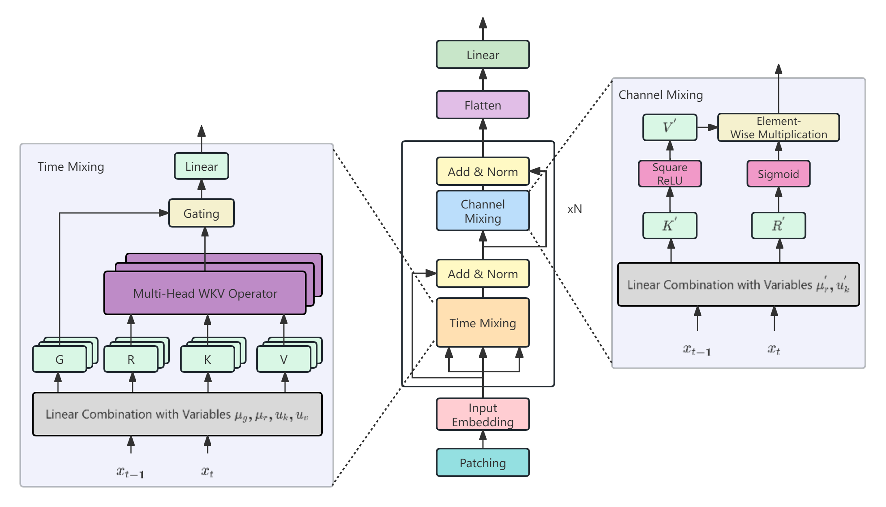

# RWKV-TS: Beyond Traditional Recurrent Neural Network for Time Series Tasks

RWKV-TS is a time-series RNN-based model that achieves both strong performance and efficiency simultaneously for time series tasks.

## Introduction
Recurrent Neural Network (RNN) architectures historically held prominence in time series tasks, yet recently encountered challenges in time series domain. As a result, recent advancements in time series forecasting have seen a notable shift away from RNNs towards alternative architectures such as Transformers, MLPs, and CNNs.
To make RNN great again, we propose RWKV-TS, a novel linear RNN architecture designed specifically for various time series tasks. In multiple time-series tasks, RWKV-TS demonstrates competitive performance when compared to state-of-the-art Transformer-based or CNN-based models. Notably, RWKV-TS exhibits not only comparable performance but also demonstrates reduced latency and memory utilization.
The success of RWKV-TS encourages further exploration and innovation in leveraging RNN-based approaches within the domain of Time Series.

<!-- 

 -->
Architecture of the RWKV-TS is shown above. RWKV-TS comprises three main components: an input module, RWKV backbone, and an output module. Firstly, the input module applies instance normalization to each channel's univariate series and segments them into patches. These patches serve as input tokens for RWKV-TS. Then, the input tokens proceed into the RWKV backbone, which comprises Time-mixing and Channel-mixing modules. Finally, the output of the last layer of the RWKV backbone is flattened and projected to predict the target.

## Time Series Tasks

The proposed RWKV-TS performs well on various time series tasks, including [long-term forecasting](./Long-term_Forecasting/README.md), [short-term forecasting](./Short-term_Forecasting/README.md), [classification](./Classification/README.md), [anomaly detection](./Anomaly_Detection/README.md), [imputation](./Imputation/README.md), and [few-shot leanring](./Few-shot_Learning/README.md).

## Get Start

- Install Python>=3.8, PyTorch 1.8.1.
- Follow the instructions provided in the respective task folder.

## Acknowledgement

We appreciate the following github repos a lot for their valuable code base or datasets:

https://github.com/DAMO-DI-ML/NeurIPS2023-One-Fits-All

https://github.com/DAMO-DI-ML/ICML2022-FEDformer

https://github.com/thuml/Time-Series-Library

https://github.com/gzerveas/mvts_transformer